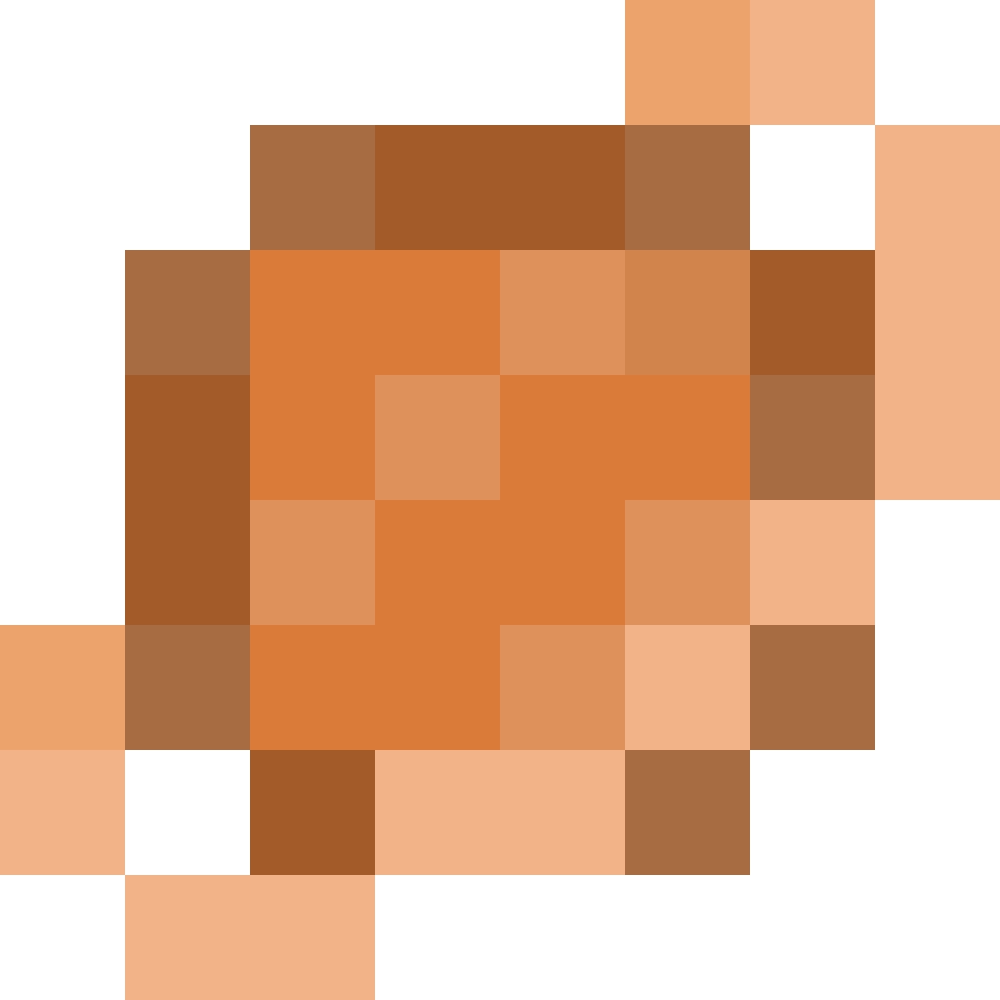

  

  
『 Saturnus - 每天一字！』

`最后更新于：2024-05-23 02:24:00`

[📚 简介](#-简介)

[📸 示例](#-示例)

[📦 使用方式](#-使用方式)

[📌 注意事项](#-注意事项)

[🧑‍💻 贡献者](#-贡献者)

[🔦 声明](#-声明)

# 📚 简介

本软件是基于 [React Native](https://reactnative.dev/) 开发的 每日一字 软件，仅支持 `Android` 平台

# 📸 示例

🚧 WIP 🚧

# 📦 使用方式

🚧 WIP 🚧

# 📌 注意事项

🚧 WIP 🚧

# 🧑‍💻 贡献者

# 🔦 声明

该项目采用 `GPL-3.0` 许可协议，查看 [LICENSE](https://github.com/Cierra-Runis/Saturnus/blob/main/LICENSE) 以获得更多信息
